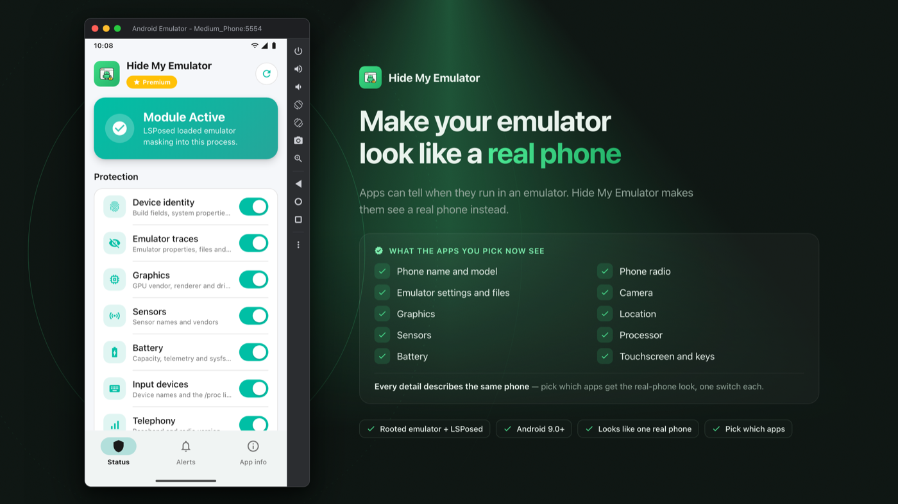

# Hide My Emulator

 

An LSPosed module that hides your emulator, so apps think they run on a real phone.

Apps can tell when they run in an emulator. Hide My Emulator makes them see a real phone instead.

## Support / Discussion

Support: https://t.me/wowareofficial  
Official Website: https://hidemyemulator.com  
How to install: https://hidemyemulator.com/en/how-to-install/  
Email: support@hidemyemulator.com

## Requirements

- Android 9.0+ (API level 28 or newer)
- A rooted Android emulator (Magisk)
- A properly working LSPosed environment
- Developed and tested on the Android Studio emulator (AVD). Other emulators that accept Magisk and LSPosed follow the same steps.
- If you are not familiar with Xposed modules, this project may not be suitable for your setup.

## How It Works

Tick the apps you want to protect in the LSPosed scope. When one of them opens, Hide My Emulator changes what it sees about the device, so every detail describes one real phone. Apps you did not tick are not touched at all, and the data, accounts and files of the apps you did tick stay as they are. Masking applies the next time a ticked app starts.

## Feature List

- **Phone name and model** — Apps see a real phone brand and model, not an emulator.
- **Emulator settings and files** — Settings and files that only an emulator has are gone, just like on a real phone.
- **Sensors** — Sensors look like real phone parts, not the emulator's fake ones.
- **Battery** — Battery size, health and charging look like a real phone.
- **Touchscreen and keys** — The touchscreen and buttons carry real hardware names.
- **Phone radio** — The modem shows a normal phone version instead of nothing.
- **Camera** — Camera count and direction match a real phone.
- **Location** — A believable last location instead of an empty one.
- **Graphics** — The graphics chip shows a real phone GPU, not the emulator's.
- **Processor** — Apps see a phone processor, not the PC chip the emulator runs on.
- **Everything matches** — Every detail describes the same phone, so nothing gives it away.
- **Pick your apps** — Choose which apps get the real-phone look. Turn each part on or off with one tap.

## Getting Started

1. **Prepare your emulator** — Root the emulator with [Magisk](https://github.com/topjohnwu/Magisk/releases) and install the [LSPosed](https://github.com/JingMatrix/LSPosed/releases) framework.
2. **Install Hide My Emulator** — Install the APK, turn the module on in LSPosed Manager and tick the apps you want.
3. **Choose what to mask** — Turn on what you want hidden in the Status tab and tap Apply. It applies the next time the app opens.
4. **Relaunch the target app** — Force-stop and reopen the app. It now sees a real phone.

Full guide with screenshots: https://hidemyemulator.com/en/how-to-install/

## Free vs Premium

Premium is managed by the [HME License](https://play.google.com/store/apps/details?id=com.wowsoftware.hmelicense) app: install it from Google Play, subscribe, and Hide My Emulator picks up your Premium status automatically. Cancel any time from Google Play subscriptions.

| Features                                             | Free | Premium (Subscription) |
| ---------------------------------------------------- | :--: | :--------------------: |
| Install the module and check its status in LSPosed   |  ✅  |           ✅           |
| Pick which apps get the real-phone look              |      |           ✅           |
| Phone name and model                                 |      |           ✅           |
| Emulator settings and files                          |      |           ✅           |
| Sensors                                              |      |           ✅           |
| Battery                                              |      |           ✅           |
| Touchscreen and keys                                 |      |           ✅           |
| Phone radio                                          |      |           ✅           |
| Camera                                               |      |           ✅           |
| Location                                             |      |           ✅           |
| Graphics                                             |      |           ✅           |
| Processor                                            |      |           ✅           |
| Updates while subscribed                             |      |           ✅           |
| Email and Telegram support                           |      |           ✅           |

## Important Notice

System-level modification always carries risk.  
Please back up your emulator image and important data before use.

## Disclaimer

Use at your own risk.  
By installing or using Hide My Emulator, you are solely responsible for how you use it.  
The developers are not responsible for misuse, violations of laws/platform policies, account penalties, data loss, instability, or bootloops.

## Ongoing Updates

Hide My Emulator is actively maintained with continuous feature and stability updates.

## Feature Requests

Feature requests are welcome.  
If you need a specific capability, share your use case on Telegram or by email and we will prioritize based on community demand.

---

From the makers of [Hide My Android](https://www.hidemyandroid.com).
